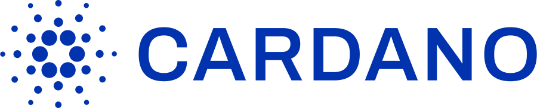
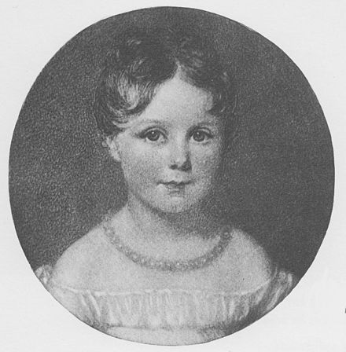

# Case Study: ***Cardano Blockchain***

## *Overview*

<h5>

<b>

[Cardano is a 3rd generation, decentralized proof-of-stake blockchain platform][define] 1

</b> 

Initial development of Cardano began in 2015 by Charles Hoskinson, a co-founder of Ethereum. Cardano uses Proof-of-stake protocol to address barriers to wide adoption of Proof-of-work blockchain protocols. 2

</h5>

> Proof-of-stake is designed as an alternative to proof-of-work (PoW) networks (e.g. 1st generation--Bitcoin; 2nd generation--Ethereum), with faster transactions and reduced energy consumption (and thus increased scalability, stability, and long-term viability). 

</h5>

*Native token:* **ADA**

*Coded in:* **[Haskell][hask]** 9

-	Named after [*Ada Lovelace*][ada], a 19th century mathematician regarded as the first computer programmer. 3

 3

## Development of Cardano

**Guiding Entities:**

1. [The Cardano Foundation][foundation]: A non-profit that supervises the advancement of Cardano and "the Cardano brand" 4

2. [IOHK (Input Output Hongkong)][iohk] 5

3. [EMURGO][emurgo] 6

### Central Principles 4

1. secure
2. transparent
3. solution for positive global change
4. diversity

[**Cardano Foundation Team Diversity:**][foundation] 4

	• 24 nationalities
	• 15 countries
	• 4 continents

### Key Dates

- [Founded: 2015][what is cardano]

- [Launched: September 2017][what is cardano]

- [Publicly-traded: October 2017][what is cardano]

Founder: [Charles Hoskinson](iohk-charles) 2

### Funding

>*Initial Coin Offering (ICO):* **$600 million** (October 1, 2017) 7 

>*Market cap (USD):* **$32.4 billion** (February 18, 2022) 8 

>*Market dominance:* **1.8575%** (February 18, 2022) 8 

## Discussion

### Advantages:

Cardano purports to be the first blockchain to be guided by science, data, and peer-reviewed research. The Cardano Foundation mission statement also asserts to pursue an environmentally friendly, decentralized monetary solution to oppression by governments and authoritarian control. These are increasingly mainstream, hotbed political issues. 

Largely the media focus of cryptocurrency as an alternative to fiat currency has been on Bitcoin and Ethereum. Cardano's mission statement appears ahead of the game in seeking to provide an answer to these concerns. 

### Disadvantages:

Critics have accused Cardano's methodical, research-first approach of being too slow, falling behind newcomers like Solana and Avalanche.9 Retail investors, professional YouTube sensations, and Twitter afficianados raise concern over the low ADA price, drawing comparison to BTC and ETH (both thousands of times greater USD).

### Caveat Emptor:

For retail investors seeking exponential growth in investments, a comparison of token value between cryptocurrencies is misguided. Cryptocurrencies trade in fractions with much greater precision than the USD and any quantity of tokens can/will be appraised against fiat currency or a stablecoin. The metrics that matter are the market cap and market dominance.

*Market cap*: Coins with low market cap theoretically have greater potential for exponential growth.

*Market dominance*: Despite the surge in popularity of relative newcomers, Cardano still remains in the top 10 in terms of market cap.

### Conclusion:

Cardano appears to be playing the long game. The cryptocurrency industry is still in the very early stages of global adoption. Cardano appears to have a solid team of developers and business analysts. With their emphasis on research, environmental sensitivity, humanitarian concerns, security, stability, and efficiency, I think there is a promising long term future for Cardano. In the short term (0-2 years), I see it as being a good investment--albeit with less likelihood of exponential returns than Solana ([which continues to receive favorable news][solnews]10). I think Cardano will have its "day in the sun" in 3-5 years, when the industry matures and starts to look for security, stability, sustainability, and philanthropy. In these arenas, Cardano could reign supreme.

[emurgo]: <https://emurgo.io/who-we-are>

[iohk-charles]: <https://iohk.io/en/team/charles-hoskinson> 

[iohk]: <https://iohk.io/>

[what is cardano]: <https://www.bankrate.com/investing/what-is-cardano/>

[ada]: <https://cardano.org/what-is-ada/>

[foundation]: <https://cardanofoundation.org/en/about-us/>

[wiki]: <https://en.wikipedia.org/wiki/Charles_Hoskinson>

[define]: <https://www.investopedia.com/cardano-definition-4683961>

[mashable interview]: <https://mashable.com/article/cardano-hoskinson-interview>

[hask]: <https://medium.com/@cardano.foundation/why-cardano-chose-haskell-and-why-you-should-care-why-cardano-chose-haskell-and-why-you-should-f97052db2951>

[solnews]: <https://cointelegraph.com/news/report-claims-each-solana-tx-uses-less-energy-than-2-google-searches>

### SOURCES

1.	https://www.investopedia.com/cardano-definition-4683961
	
2.	https://iohk.io/en/team/charles-hoskinson>

3.	https://cardano.org/what-is-ada/

4.	https://cardanofoundation.org/en/about-us/

5.	https://iohk.io/

6.	https://emurgo.io/who-we-are

7.	https://www.bankrate.com/investing/what-is-cardano/

8.	https://www.slickcharts.com/currency. Accessed 18 Feb. 2022.

9.	https://medium.com/@cardano.foundation/why-cardano-chose-haskell-and-why-you-should-care-why-cardano-chose-haskell-and-why-you-should-f97052db2951

10. https://cointelegraph.com/news/report-claims-each-solana-tx-uses-less-energy-than-2-google-searches

<!-- 	https://mashable.com/article/cardano-hoskinson-interview -->

<!-- 	https://en.wikipedia.org/wiki/Charles_Hoskinson -->

